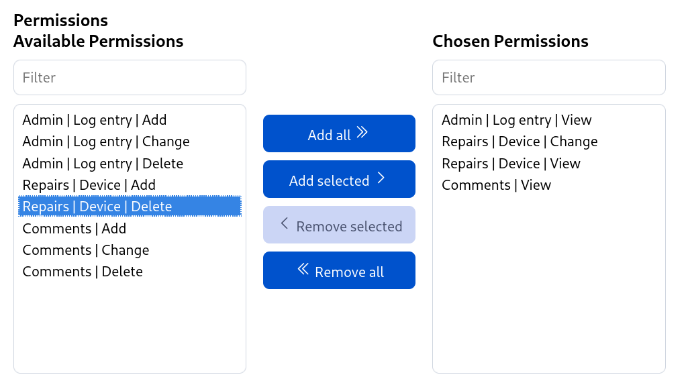
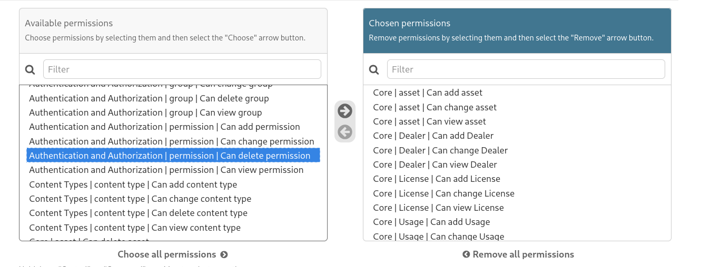

# Filtered Select Multiple Widget

A dependency-free, JavaScript implementation of Django's dual-pane “FilteredSelectMultiple” widget. It transforms a native `<select multiple>` element into a picker with move buttons and client-side filtering.



## Why?

I had been missing the beautiful and, above all, practical Django admin widget `filter-horizontal` outside of the Django Admin interface for quite some time.

<details>
<summary>And how does it look in the Django admin?</summary>



References:

- [Django admin docs `filter_horizontal`](https://docs.djangoproject.com/en/5.2/ref/contrib/admin/#django.contrib.admin.ModelAdmin.filter_horizontal)
- [Django admin `FilteredSelectMultiple`](https://github.com/django/django/blob/main/django/contrib/admin/widgets.py#L23C1-L23C52)
- [Django admin `SelectBox`](https://github.com/django/django/blob/main/django/contrib/admin/static/admin/js/SelectBox.js)

The Django widget is a thousand times better than mine. But I hope to gradually improve my implementation.

</details>

## Features

- Zero dependencies and ES module friendly.
- Works with any native `<select multiple>` element.
- Optional client-side filtering of the available choices.
- Keyboard friendly and form-ready (synced back to the original select element).
- Integrates with Bootstrap 5, DaisyUI, and Tailwind CSS (see live demo with theme switcher).
- Automatically detects pane labels from associated `<label>` elements.

## Demo

```bash
npm install
npm run demo
```

The demo includes a theme switcher navigation bar to showcase integration with Bootstrap 5, DaisyUI, and Tailwind CSS.

## Installation

```bash
npm install git+https://gitlab.gwdg.de/t.breitner/filtered-select-multiple-widget.git
```

## Usage

```html
<select id="permissions" name="permissions" multiple>
  <option value="read">Read</option>
  <option value="write" selected>Write</option>
  <option value="admin">Admin</option>
</select>
```

```js
import { FilteredSelectMultiple } from "filtered-select-multiple-widget";

const select = document.querySelector("#permissions");
const widget = new FilteredSelectMultiple(select);
```

### Options

| Option | Type | Default | Description |
| ------ | ---- | ------- | ----------- |
| `showFilter` | `boolean` | `true` | Toggle the search box above the available list. |
| `filterMatchMode` | `'contains' \| 'startsWith'` | `'contains'` | How filtering behaves. |
| `size` | `number` | `select.size \|\| clamp(optionCount)` | Number of visible rows for each list. |
| `preserveSelectionOrder` | `boolean` | `false` | Keep the order items were added in the chosen list rather than the original option order. |
| `text` | `object` | see defaults | Override UI copy (`availableLabel`, `chosenLabel`, `filterPlaceholder`, `availableFilterPlaceholder`, `chosenFilterPlaceholder`, `addAll`, `addSelected`, `removeSelected`, `removeAll`). If `availableLabel` and `chosenLabel` are not provided, the widget will attempt to auto-detect them from an associated `<label>` element. |
| `theme` | `Theme` | `defaultTheme` | CSS theme configuration for styling framework integration. |

### Theming & Framework Integration

The widget supports some UI frameworks through configurable themes:

```js
import { 
  FilteredSelectMultiple, 
  bootstrap5Theme, 
  daisyUITheme, 
  tailwindTheme 
} from "filtered-select-multiple-widget";

// Bootstrap 5
new FilteredSelectMultiple(select, { theme: bootstrap5Theme });

// DaisyUI 5
new FilteredSelectMultiple(select, { theme: daisyUITheme });

// Tailwind CSS 4
new FilteredSelectMultiple(select, { theme: tailwindTheme });
```

#### Custom Themes

```js
import { Theme } from "filtered-select-multiple-widget";

const customTheme = new Theme({
  container: "my-widget-container",
  button: "my-button-class",
  buttonAddSelected: "my-button-class my-primary-button",
  filter: "my-input-class",
  select: "my-select-class",
  // ... customize any element
});

new FilteredSelectMultiple(select, { theme: customTheme });
```

#### Available Theme Elements

- `container` - Main widget wrapper
- `column`, `availableColumn`, `chosenColumn` - Pane containers  
- `label` - Pane labels
- `filter` - Search input fields
- `select` - Multi-select elements
- `controls` - Button container
- `button`, `buttonAddAll`, `buttonAddSelected`, `buttonRemoveSelected`, `buttonRemoveAll` - Control buttons
- `buttonDisabled` - Disabled button modifier

### Destroying the widget

```js
widget.destroy();
```

The original `<select>` is restored and remains in sync with user selections.

## Third-Party Assets

<details>
<summary>Heroicons</summary>

This project uses icons from [Heroicons](https://heroicons.com/), which is licensed under the MIT License.

Copyright (c) Tailwind Labs, Inc.

Permission is hereby granted, free of charge, to any person obtaining a copy
of this software and associated documentation files (the "Software"), to deal
in the Software without restriction, including without limitation the rights
to use, copy, modify, merge, publish, distribute, sublicense, and/or sell
copies of the Software, and to permit persons to whom the Software is
furnished to do so, subject to the following conditions:

The above copyright notice and this permission notice shall be included in all
copies or substantial portions of the Software.

THE SOFTWARE IS PROVIDED "AS IS", WITHOUT WARRANTY OF ANY KIND, EXPRESS OR
IMPLIED, INCLUDING BUT NOT LIMITED TO THE WARRANTIES OF MERCHANTABILITY,
FITNESS FOR A PARTICULAR PURPOSE AND NONINFRINGEMENT. IN NO EVENT SHALL THE
AUTHORS OR COPYRIGHT HOLDERS BE LIABLE FOR ANY CLAIM, DAMAGES OR OTHER
LIABILITY, WHETHER IN AN ACTION OF CONTRACT, TORT OR OTHERWISE, ARISING FROM,
OUT OF OR IN CONNECTION WITH THE SOFTWARE OR THE USE OR OTHER DEALINGS IN THE
SOFTWARE.

</details>

<details>
<summary>Django project</summary>

Thank you for being here and for all the inspiration.

BSD 3-Clause license.

</details>

## License

MIT
